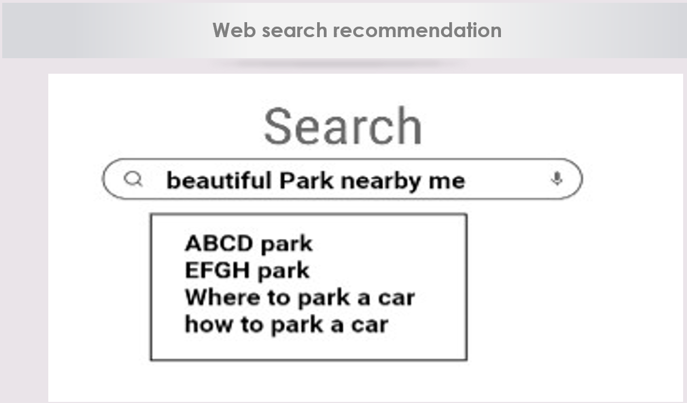
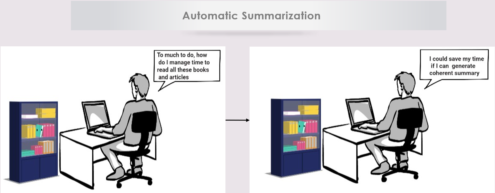
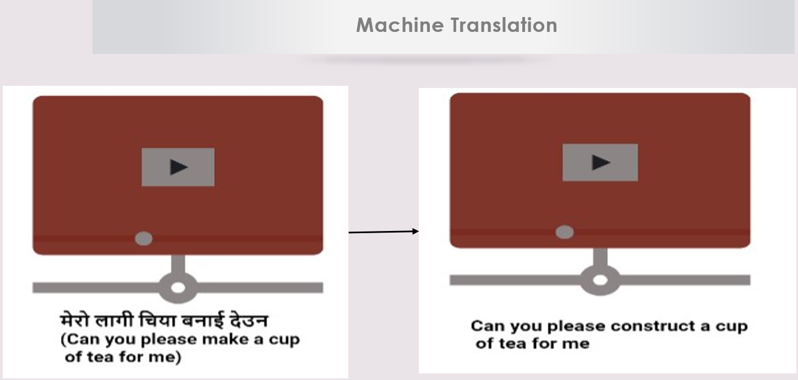
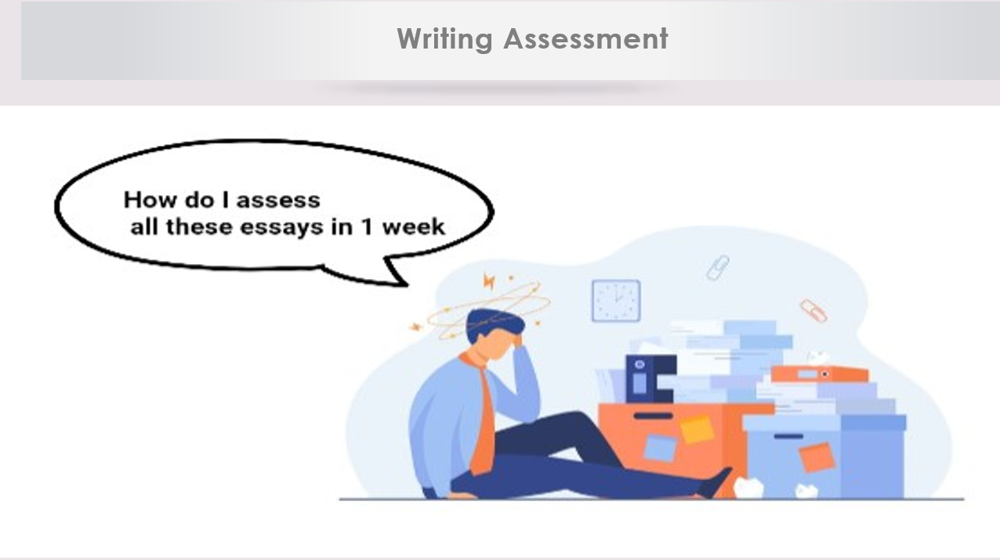

# MasterThesis 

## Abstract

`The goal of this thesis is to investigate automatic measures for the identification of text quality patterns in search-supported
essay writing. Text quality in terms of organization, coherence, cohesion, readability, or vocabulary typically varies throughout
a text, and automatically finding lower-quality paragraphs can help streamline the workflow of editors. Coherence measures
like Type-Token ratio, cosine similarity, or entity grid investigate whether the ideas, concepts, or themes in the text link together
smoothly in the text flow. In this work, we compare a selection of established text coherence measures from the computational
linguistics literature and apply them to a dataset of 150 long essays with detailed revision history. These essays were written
in an experimental environment which recorded every revision authors made while developing their texts. This allows us
to investigate not only how text quality develops across the paragraphs of the finished text, but also over time as the text is
written.`

## Some of Coherence Based text Quality's Areas of Impact

  
    
  

   
    
  

These images are taken from my Master thesis Slides.

